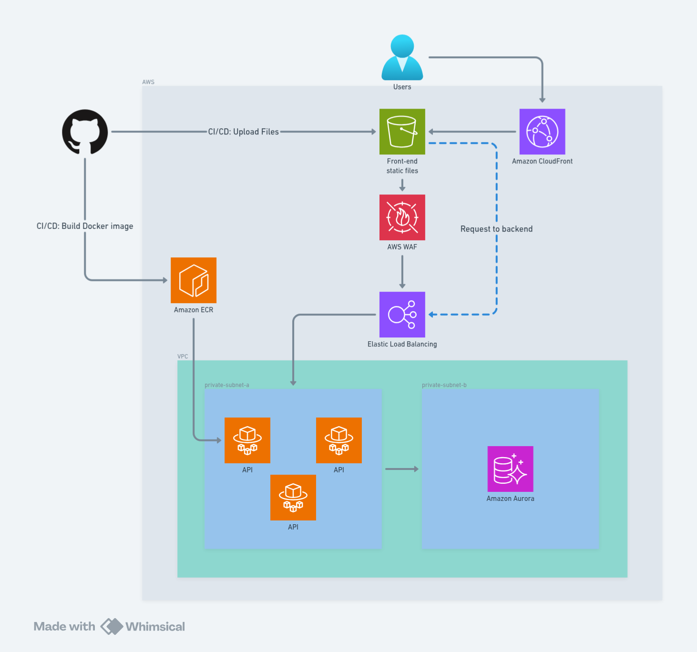

# Desafio DevOps/SRE

## Objetivo do desafio (resumo original)

Provisionar uma infraestrutura completa para uma aplicação web composta por:
- Frontend (React)
- Backend (API)
- Banco de dados

Garantindo:
1. Acessibilidade aos clientes
2. Alta disponibilidade
3. Escalabilidade
4. Segurança

Tudo via **Infraestrutura como Código (IaC)** e **AWS**.

## Solução




| Camada         | Tecnologia utilizada                                                                                 | Motivo da escolha (por que é padrão em fintechs) |
|----------------|-------------------------------------------------------------------------------------------------------|--------------------------------------------------|
| **Frontend**   | React → Build estático → **S3 + CloudFront (OAC)** + WAF + HTTPS automático                          | Menor custo, latência global (CDN), segurança máxima (bucket privado), entrega instantânea |
| **CDN + WAF**  | **CloudFront** com Origin Access Control + **WAF v2** (AWS Managed Rules + Rate Limit 2000/5min)   | Proteção OWASP Top 10 |
| **Backend**    | Node.js + Express + TypeScript + Prisma → Container → **ECS Fargate** (serverless)                    | Zero gerenciamento de servidores, auto-scaling nativo, custo por uso |
| **Load Balancer** | **Application Load Balancer (ALB)** com HTTPS (ACM) + WAF Regional + redirect 80→443              | Alta disponibilidade, healthcheck automático, integração nativa com Fargate |
| **Banco de dados** | **Aurora PostgreSQL Serverless v2** (Multi-AZ, auto-pause, encrypted) + Secrets Manager           | Zero ops, escala automática, pausa quando não usado (custo quase zero), alta disponibilidade |
| **Container Registry** | **Amazon ECR** privado, imutável, scan on push                                                  | Segurança de imagens, controle de versão, integração perfeita com ECS |
| **CI/CD**      | **GitHub Actions + OIDC** (zero access keys) → build → ECR → force new deployment no Fargate      | Segurança máxima (sem chaves no repo), deploy automático a cada push na main |
| **IaC**        | **Terraform** modular (12 módulos reutilizáveis) + state no S3 + DynamoDB lock                     | Tudo versionado, auditável, reproduzível. |
| **Observabilidade** | CloudWatch Logs (JSON) + Container Insights + Performance Insights no Aurora                    | Logs estruturados, métricas, alertas prontos para futuro |

## Endpoints disponíveis

| URL | Descrição |
|-----|----------|
| `https://d2ov19qg8tpxm7.cloudfront.net/` | Frontend React (healthcheck + lista de usuários) |
| `https://xxxxxxxxx.us-east-1.elb.amazonaws.com/health` | Healthcheck completo (verifica banco) |
| `https://xxxxxxxxx.us-east-1.elb.amazonaws.com/api/users` | Lista paginada de usuários reais (100+ registros com seed) |

## Como rodar localmente (opcional)

```bash
# Frontend
cd frontend && npm install && npm run dev

# Backend
cd backend && npm install && npm run dev